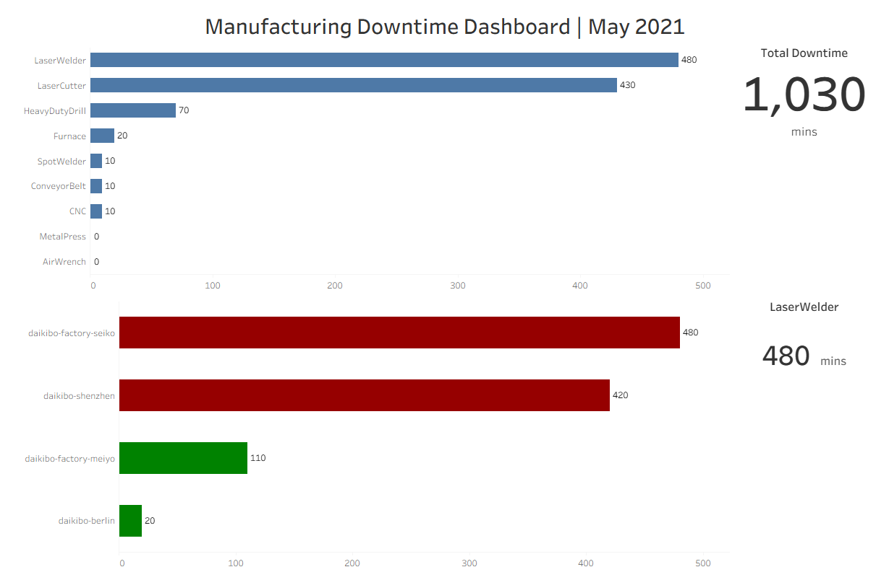
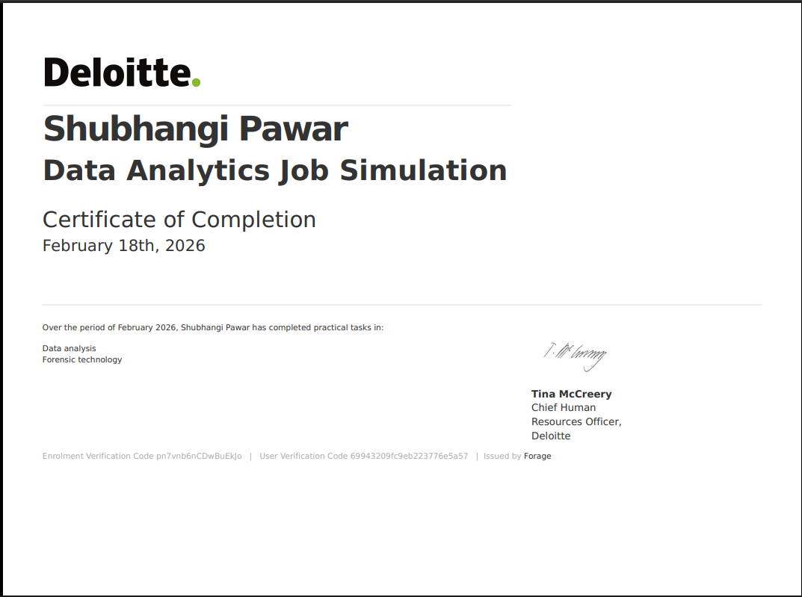

## 📊 Deloitte Australia – Data Analytics Job Simulation

Author: Shubhangi Pawar

Completion Date: February 2026

Platform: Forage (Deloitte Australia Virtual Experience)

## 🔎 Project Overview

This repository showcases my end-to-end analytical solution developed as part of the Deloitte Australia Data Analytics Virtual Experience (Forage). 

The project simulates real-world consulting scenarios involving operational analytics and forensic pay equity assessment, demonstrating data visualization, logical classification, and business insight generation.

---

## 🔗 Live Tableau Dashboard

Explore the interactive Manufacturing Downtime Dashboard:

👉 https://public.tableau.com/app/profile/shubhangi.pawar2124/viz/Shubhangi_Pawar_Manufacturing_Downtime_Dashboard/Dashboard?publish=yes

---

## 📊 Project Summary

The simulation included two core analytical tasks:

---

### 🔹 Task 1: Manufacturing Downtime Analysis (Tableau)

**Objective:** Identify operational bottlenecks across devices and factories.

- Built an interactive Tableau dashboard analyzing machine downtime
- Designed KPI cards for:
  - Total Downtime
  - Highest Downtime Device
- Used bar visualizations to compare downtime across factories
- Structured layout using containers for clean executive presentation
- Delivered insights highlighting production inefficiencies

Key Insight:
LaserWelder and LaserCutter accounted for the majority of total downtime, indicating targeted maintenance strategies could significantly improve operational efficiency.

---

### 🔹 Task 2: Gender Pay Equality Classification (Excel – Forensic Analysis)

**Objective:** Classify job roles based on equality scores to assess pay fairness.

- Processed compensation data across factories
- Created a new “Equality Class” column using logical conditions
- Implemented classification logic using:

 =IF(ABS(C2)<=10,"Fair",
   IF(ABS(C2)<=20,"Unfair",
   "Highly Discriminative"))

📌 Applied structured thresholds:

±10 → Fair

±20 → Unfair

Beyond ±20 → Highly Discriminative

Delivered consistent and rule-based classification output

Key Insight:
Certain senior management roles exhibited highly discriminatory equality scores, suggesting potential structural pay imbalance requiring HR policy review.

## 🔄 Analytical Workflow

Data → Cleaning & Processing → Analysis → Visualization → Business Insight → Executive Presentation

This project demonstrates a complete analytics lifecycle aligned with consulting delivery standards.

## 🛠 Tools & Technical Skills Demonstrated

| Area | Technologies / Methods Used |
|------|-----------------------------|
| Data Visualization | Tableau Public, KPI Card Design, Executive Dashboard Layout |
| Data Analysis | Trend Analysis, Root Cause Identification, Comparative Analysis |
| Excel Modeling | IF(), Nested IF(), ABS(), Rule-based Classification |
| Business Insight | Forensic Data Evaluation, Operational Bottleneck Identification |
| Reporting | Stakeholder-focused Presentation, Insight Communication |

📌 Key Outcomes & Impact

Developed stakeholder-ready dashboard with actionable insights

Translated business problems into analytical frameworks

Applied structured classification methodology for forensic evaluation

Demonstrated end-to-end analytics workflow (Data → Analysis → Insight → Presentation)

📌 Skills Demonstrated

Data Cleaning & Structuring

Business Rule Implementation

Dashboard Design & KPI Visualization

Analytical Thinking

Data Classification Modeling

Insight Communication

## 🎓 Certification
Deloitte Australia – Data Analytics Job Simulation

📅 February 2026
🏢 Issued by Deloitte (via Forage)

  

## 👤 Author

**Shubhangi Pawar**

- 📧 Email: ishubhangipawar@gmail.com
- 💼 LinkedIn: linkedin.com/in/shubhangipawar18
- 🌐 GitHub: github.com/shubhangipawar18

### Background
Former SNOC Engineer at Vodafone with 2+ years of telecom operations experience. Now combining domain expertise with data analytics skills to drive business insights.

---

## 🙏 Acknowledgments

- Dataset: [IBM Sample Data via Kaggle](https://www.kaggle.com/datasets/blastchar/telco-customer-churn)
- Tools: PostgreSQL, Power BI

---

⭐ **If you found this project useful, please give it a star!**

